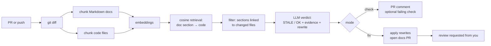

# DocSentry

Self-healing technical documentation. A composite GitHub Action that watches
code changes, detects when they make your documentation inaccurate, and either
flags the stale sections on the PR or opens a PR with the corrected docs.

An independent **Jev PR triage** mode checks scope alignment, visible test
evidence, compatibility, and sensitive changes, then maintains one advisory
comment for maintainers. It supports fork PRs without executing contributor code.

## The problem

Docs rot. A PR renames a function, changes a default, removes a flag — and the
README keeps describing the old behavior. Nobody notices until a user hits it.

## What DocSentry does



1. **Diff** — extract changed files and hunks from `base...head`
2. **Parse** — split every Markdown doc into heading-level sections
3. **Embed** — OpenAI `text-embedding-3-small` for doc sections and code chunks
4. **Retrieve** — in-memory cosine similarity maps each doc section to its
   most related code
5. **Filter** — keep only sections whose related code changed in this PR
   (the cost cap: no changed code, no LLM calls)
6. **Analyze** — `gpt-4o-mini` gets the doc section + current code + diff hunk
   and returns structured JSON: `status`, `evidence`, `suggested_rewrite`
7. **Act** — check mode posts a report on the PR; fix mode applies the
   rewrites and opens a docs PR with review requested from you

## Usage

```yaml
name: DocSentry

on:
  pull_request:
  push:
    branches: [main]
  workflow_dispatch:
    inputs:
      mode:
        description: DocSentry mode
        type: choice
        options: [check, fix]
        default: check

jobs:
  check:
    if: github.event_name == 'pull_request' || (github.event_name == 'workflow_dispatch' && github.event.inputs.mode != 'fix')
    runs-on: ubuntu-latest
    permissions:
      contents: read
      pull-requests: write
    steps:
      - uses: actions/checkout@v4
        with:
          fetch-depth: 0 # required: DocSentry diffs base...head
      - uses: utkukosman1/self-healing-technical-documentation@v1
        with:
          openai-api-key: ${{ secrets.OPENAI_API_KEY }}
          mode: check
          reviewer: your-github-username # auto-review-request on fix PRs

  fix:
    if: >-
      (github.event_name == 'push' && vars.DOCSENTRY_AUTO_HEAL == 'true') ||
      (github.event_name == 'workflow_dispatch' && github.event.inputs.mode == 'fix')
    runs-on: ubuntu-latest
    concurrency:
      group: docsentry-fix
      cancel-in-progress: false
    permissions:
      contents: write
      pull-requests: write
    steps:
      - uses: actions/checkout@v4
        with:
          fetch-depth: 0
      - uses: utkukosman1/self-healing-technical-documentation@v1
        with:
          openai-api-key: ${{ secrets.OPENAI_API_KEY }}
          mode: fix
          reviewer: your-github-username
```

### Modes

| Mode | When | Behavior |
|---|---|---|
| `check` | PR events | Comments the PR with stale sections, evidence, and suggested rewrites. With `fail-on-stale: true`, the check fails. |
| `fix` | Push to main / manual dispatch | Rewrites the stale sections in-place, commits on a new branch, opens a PR, and requests your review. |
| `review` | PR events, including forks | Uses Jev through TypeSafe or OpenRouter to update one advisory triage comment. Requires the selected provider's key, not an OpenAI key. |

### Jev PR triage

For OpenRouter, add a repository Actions secret named `OPENROUTER_API_KEY`, then
add a dedicated workflow. Replace `PINNED_DOCSENTRY_COMMIT` with the full commit SHA of a trusted
DocSentry revision containing review mode; older `v1` revisions do not include it.

```yaml
name: DocSentry PR triage
on:
  pull_request_target:
    types: [opened, reopened, synchronize, edited, ready_for_review]

permissions:
  contents: read
  pull-requests: write

concurrency:
  group: docsentry-review-${{ github.repository }}-${{ github.event.pull_request.number }}
  cancel-in-progress: true

jobs:
  review:
    if: github.event.pull_request.draft == false
    runs-on: ubuntu-latest
    timeout-minutes: 5
    steps:
      - uses: utkukosman1/self-healing-technical-documentation@PINNED_DOCSENTRY_COMMIT
        with:
          mode: review
          jev-provider: openrouter
          openrouter-api-key: ${{ secrets.OPENROUTER_API_KEY }}
```

OpenRouter uses its [Decisions API](https://openrouter.ai/docs/api/api-reference/alphadecisions/submit-a-decisions-questions-and-answers-request)
with the default model `typesafe/jev-1.13`. This is an alpha endpoint. An OpenRouter
key is sufficient; you do not need a separate TypeSafe key. The request uses the
same four questions and confidence policy as direct TypeSafe access. Requests
have bounded timeouts and at most two retries for transient failures; auth,
credit, and invalid-request errors are not retried. There is no automatic fallback
between providers.

For direct TypeSafe access, create `TYPESAFE_API_KEY` and replace the step's inputs with:

```yaml
with:
  mode: review
  jev-provider: typesafe
  typesafe-api-key: ${{ secrets.TYPESAFE_API_KEY }}
```

The action defaults to `jev-provider: typesafe` for compatibility. An empty
`jev-model` selects `jev-latest` for TypeSafe or `typesafe/jev-1.13` for OpenRouter;
an explicit model value is passed unchanged to the chosen provider. Model names
are provider-specific. This repository's dogfood workflow explicitly selects
OpenRouter, so adding `OPENROUTER_API_KEY` is sufficient once it is deployed.

No checkout step is needed for consumers. The action obtains PR metadata and
diffs through `gh`. This repository's own `.github/workflows/review.yml` instead
checks out trusted default-branch code to dogfood the local action. Changes to
the reviewer itself take effect once they reach that trusted branch.

`pull_request_target` can use repository secrets and comment on fork PRs.
**Never add a PR-head checkout, contributor scripts, or contributor dependency
installation to this workflow.** Keep the review job separate from jobs that
test PR code. See [GitHub's event guidance](https://docs.github.com/en/actions/reference/workflows-and-actions/events-that-trigger-workflows#pull_request_target).

The report includes the reviewed head SHA, coverage, four assessment results,
model confidence, and fixed follow-up guidance:

| Result | Meaning |
|---|---|
| No concerns detected | All assessments are clear or inapplicable, and the supplied patches are complete. This is not merge approval. |
| Needs attention | At least one assessment identifies a review priority with confidence at or above `0.80`. |
| Insufficient context | Coverage is incomplete or an assessment is unknown/low-confidence, with no confident attention result. |
| Review unavailable | Configuration, GitHub access, or the TypeSafe request failed. An older comment might remain if publication failed. |

The four questions cover whether changes match the stated purpose, whether
behavior changes have relevant visible tests or weakened assertions, whether
public contracts/defaults/data formats change, and whether authentication,
authorization, credentials, dependency installation, or CI permissions change.
Sensitive changes are review priorities, not proven vulnerabilities. A missing
PR description makes scope alignment unknown.

Jev receives the PR title, description, and up to **30 complete file patches**
with changed-file metadata, within **100,000 serialized context characters**.
Titles/descriptions may be shortened to fit; omissions are reported. Binary,
missing, truncated, or inconsistent patches cannot produce complete coverage.
Review mode sends this source data to the selected provider: directly to TypeSafe,
or through OpenRouter to TypeSafe. It does not call OpenAI. It does
not fetch URLs in PR text or inspect unchanged source files or existing tests.

[Jev returns typed decisions, not generated explanations](https://docs.typesafe.ai/introduction).
DocSentry renders a template and applies verdict policy in Python. The initial
`0.80` confidence threshold is provisional, not a probability that the PR is
correct. Validate it for your project with the evaluation fixtures below.

One marked comment is created or updated, independently of documentation
comments. The report also appears in the Actions summary. Draft/closed PRs are
skipped, and results are discarded if the PR changes before publication. The
final check and comment write are separate GitHub operations, so the displayed
SHA remains the authority during a last-moment update.

Findings do not fail the job, approve PRs, change labels, request reviewers,
mention maintainers, or merge anything. Operational errors fail the job so
maintainers can fix configuration or rerun it. **Do not make this advisory job
a required branch-protection check.** Existing documentation jobs are independent.

> **Fix mode requirement:** GitHub blocks workflow-created PRs by default.
> Enable **Settings → Actions → General → "Allow GitHub Actions to create and
> approve pull requests"**, or fix-mode PRs will fail with
> `GitHub Actions is not permitted to create or approve pull requests`.

### Automatic healing (opt-in)

By default DocSentry only *flags* on pull requests; merging changes nothing
by itself. To have fix PRs open automatically after every merge to main:

1. Add a push trigger with a guarded fix job:

   ```yaml
   on:
     pull_request:
     push:
       branches: [main]

   jobs:
     check:
       if: github.event_name == 'pull_request'
       # ... mode: check ...
     fix:
       if: github.event_name == 'push' && vars.DOCSENTRY_AUTO_HEAL == 'true'
       concurrency:
         group: docsentry-fix
         cancel-in-progress: false
       # ... mode: fix, reviewer: you ...
   ```

2. Create the switch: **Settings → Secrets and variables → Actions →
   Variables** → new variable `DOCSENTRY_AUTO_HEAL` = `true`.

Delete the variable (or set anything else) to turn auto-heal off — no file
changes needed. Manual dispatch keeps working either way. Merging the bot's
own docs PRs is loop-safe: that diff is docs-only, so the follow-up run
exits quietly.

### Inputs

| Input | Default | Description |
|---|---|---|
| `openai-api-key` | — | Required for `check`/`fix`, stored in `secrets.OPENAI_API_KEY` |
| `typesafe-api-key` | — | Required for `review` with provider `typesafe`, stored in `secrets.TYPESAFE_API_KEY` |
| `openrouter-api-key` | — | Required for `review` with provider `openrouter`, stored in `secrets.OPENROUTER_API_KEY` |
| `jev-provider` | `typesafe` | Jev API provider: `typesafe` or `openrouter` |
| `jev-model` | Provider default | Empty selects `jev-latest` (TypeSafe) or `typesafe/jev-1.13` (OpenRouter) |
| `github-token` | `github.token` | Token for PR comments / fix PRs |
| `mode` | `check` | `check`, `fix`, or `review` |
| `docs-glob` | `README.md,docs/**/*.md` | Comma-separated globs for documentation files |
| `chat-model` | `gpt-4.1-mini` | Model for staleness verdicts and rewrites |
| `embedding-model` | `text-embedding-3-small` | Model for embeddings |
| `max-sections` | `20` | Cost cap: max doc sections analyzed per run |
| `fail-on-stale` | `false` | Fail the check when stale docs are found |
| `reviewer` | — | GitHub username auto-requested for review on fix PRs |

### Outputs

| Output | Description |
|---|---|
| `result` | Run summary, e.g. `analyzed=3 ok=1 stale=2` |
| `review-verdict` | Review only: `no_concerns_detected`, `needs_attention`, `insufficient_context`, `unavailable`, or `skipped` |
| `review-head-sha` | Review only: captured PR head SHA; empty when it could not be obtained |

## Architecture

```
action.yml              composite action definition
src/
├── main.py             orchestrator: pipeline wiring + modes
├── differ.py           git diff → changed files + hunks
├── docs_parser.py      Markdown → heading-level sections, safe section rewriting
├── embeddings.py       OpenAI embeddings + in-memory cosine retrieval
├── analyzer.py         LLM staleness verdicts (JSON mode) + rewrites
├── prompts.py          auditor system prompt + prompt builder
└── github_client.py    PR comments + fix PRs via the gh CLI
tests/                  offline unit + end-to-end tests (OpenAI mocked)
```

### Design decisions

- **No vector database.** CI runners are stateless, so re-embedding per run is
  the right trade: a few cents and seconds versus real infrastructure.
- **Structured LLM output with fail-open parsing.** Malformed JSON degrades to
  "OK/skip" — a bad model response can never break a run or corrupt docs.
- **Evidence-mandatory verdicts.** The prompt requires the model to cite the
  exact code that makes a section stale, cutting down hallucinations.
- **Exact-span rewrites.** Fix mode replaces only the located section; any
  ambiguity (duplicate headings, missing anchors) skips the rewrite instead of
  guessing.
- **gh CLI for PR operations.** No third-party actions; works with just the
  built-in `GITHUB_TOKEN`.
- **Cost controls.** Only sections linked to changed files reach the LLM;
  `max-sections` bounds the worst case.

## Development

```bash
pip install -r requirements-dev.txt
python -m pytest            # offline: OpenAI is mocked, no network
```

With an API key in the environment, a live smoke test:

```powershell
$env:OPENAI_API_KEY = "sk-..."
```

This repo dogfoods itself: `.github/workflows/dogfood.yml` runs DocSentry on
its own PRs.

### Evaluate Jev before wider adoption

`examples/jev_review_cases.json` contains hand-labeled examples for clean changes,
scope drift, weakened tests, compatibility changes, CI permissions, missing
context, and prompt injection. Labels are expectations to evaluate, not claims
about measured model accuracy. The tiny fixture set is not a production benchmark.

```bash
python -m examples.evaluate_jev        # offline fixture validation
python -m examples.evaluate_jev --live # calls the configured Jev provider
```

For OpenRouter, set `DOCSENTRY_JEV_PROVIDER=openrouter` and provide
`DOCSENTRY_OPENROUTER_API_KEY` securely in your shell environment. For direct
TypeSafe, set `DOCSENTRY_JEV_PROVIDER=typesafe` and `DOCSENTRY_TYPESAFE_API_KEY`.
Optionally set `DOCSENTRY_JEV_MODEL`. The evaluator reports the selected provider and model, label
mismatches, false attention flags, and unknown counts, exits nonzero on mismatches
or API failure, and never writes to GitHub. Unit tests mock all provider calls.
Inspect mismatches and abstentions before tuning the threshold or promoting a
new model; `jev-latest` may change over time.

For a live workflow smoke test, deploy the trusted workflow to a sandbox's
default branch and configure its selected provider's secret. Open a fork PR, push another
commit, then edit its description. Verify there is exactly one triage comment,
that it follows the current head SHA, and that any documentation comment is
preserved. This validation requires real GitHub access and a key for the selected Jev provider.

## Limitations (v1)

- Markdown docs only (`README.md` + `docs/**` by default).
- Staleness detection is probabilistic — evidence is cited, but always review
  the bot's fix PRs before merging.
- Fix mode is intended for post-merge correction (push to main or manual
  dispatch); use check mode during PR review.
