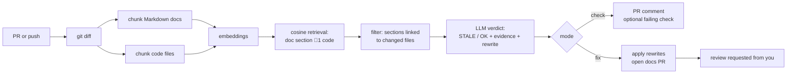

# DocSentry

Self-healing technical documentation. A composite GitHub Action that watches
code changes, detects when they make your documentation inaccurate, and either
flags the stale sections on the PR or opens a PR with the corrected docs.

## The problem

Docs rot. A PR renames a function, changes a default, removes a flag — and the
README keeps describing the old behavior. Nobody notices until a user hits it.

What DocSentry does



1. **Diff** 1 extract changed files and hunks from `base...head`
2. **Parse** 1 split every Markdown doc into heading-level sections
3. **Embed** 1 OpenAI `text-embedding-3-small` for doc sections and code chunks
4. **Retrieve** 1 in-memory cosine similarity maps each doc section to its
   most related code
5. **Filter** 1 keep only sections whose related code changed in this PR
   (the cost cap: no changed code, no LLM calls)
6. **Analyze** 1 `gpt-4o-mini` gets the doc section + current code + diff hunk
   and returns structured JSON: `status`, `evidence`, `suggested_rewrite`
7. **Act** 1 check mode posts a report on the PR; fix mode applies the
   rewrites and opens a docs PR with review requested from you
### Automatic healing (opt-in)

By default DocSentry only *flags* on pull requests; merging changes nothing
by itself. To have fix PRs open automatically after every merge to main:

1. Add a push trigger with a guarded fix job:

   ```yaml
   on:
     pull_request:
     push:
       branches: [main]

   jobs:
     check:
       if: github.event_name == 'pull_request'
       # ... mode: check ...
     fix:
       if: github.event_name == 'push' && vars.DOCSENTRY_AUTO_HEAL == 'true'
       concurrency:
         group: docsentry-fix
         cancel-in-progress: false
       # ... mode: fix, reviewer: you ...
   ```

2. Create the switch: **Settings → Secrets and variables → Actions →
   Variables** → new variable `DOCSENTRY_AUTO_HEAL` = `true`.

Delete the variable (or set anything else) to turn auto-heal off — no file
changes needed. Manual dispatch keeps working either way. Merging the bot's
own docs PRs is loop-safe: that diff is docs-only, so the follow-up run
exits quietly.

### Inputs

| Input | Default | Description |
|---|---|---|
| `openai-api-key` | — (required) | OpenAI API key, stored in `secrets.OPENAI_API_KEY` |
| `github-token` | `github.token` | Token for PR comments / fix PRs |
| `mode` | `check` | `check` or `fix` |
| `docs-glob` | `README.md,docs/**/*.md` | Comma-separated globs for documentation files |
| `chat-model` | `gpt-4.1-mini` | Model for staleness verdicts and rewrites |
| `embedding-model` | `text-embedding-3-small` | Model for embeddings |
| `max-sections` | `20` | Cost cap: max doc sections analyzed per run |
| `fail-on-stale` | `false` | Fail the check when stale docs are found |
| `reviewer` | — | GitHub username auto-requested for review on fix PRs |

### Outputs

| Output | Description |
|---|---|
| `result` | Run summary, e.g. `analyzed=3 ok=1 stale=2` |

## Architecture

```
action.yml              composite action definition
src/
├── main.py             orchestrator: pipeline wiring + modes
├── differ.py           git diff → changed files + hunks
├── docs_parser.py      Markdown → heading-level sections, safe section rewriting
├── embeddings.py       OpenAI embeddings + in-memory cosine retrieval
├── analyzer.py         LLM staleness verdicts (JSON mode) + rewrites
├── prompts.py          auditor system prompt + prompt builder
└── github_client.py    PR comments + fix PRs via the gh CLI
tests/                  offline unit + end-to-end tests (OpenAI mocked)
```

### Design decisions

- **No vector database.** CI runners are stateless, so re-embedding per run is
  the right trade: a few cents and seconds versus real infrastructure.
- **Structured LLM output with fail-open parsing.** Malformed JSON degrades to
  "OK/skip" — a bad model response can never break a run or corrupt docs.
- **Evidence-mandatory verdicts.** The prompt requires the model to cite the
  exact code that makes a section stale, cutting down hallucinations.
- **Exact-span rewrites.** Fix mode replaces only the located section; any
  ambiguity (duplicate headings, missing anchors) skips the rewrite instead of
  guessing.
- **gh CLI for PR operations.** No third-party actions; works with just the
  built-in `GITHUB_TOKEN`.
- **Cost controls.** Only sections linked to changed files reach the LLM;
  `max-sections` bounds the worst case.

## Development

```bash
pip install -r requirements-dev.txt
python -m pytest            # offline: OpenAI is mocked, no network
```

With an API key in the environment, a live smoke test:

```powershell
$env:OPENAI_API_KEY = "sk-..."
```

This repo dogfoods itself: `.github/workflows/dogfood.yml` runs DocSentry on
its own PRs.

Limitations (v1)

- Markdown docs only (`README.md` + `docs/**` by default).
- Staleness detection is probabilistic — evidence is cited, but always review
  the bot's fix PRs before merging.
- Fix mode can be triggered post-merge on push to main if the environment variable
  `DOCSENTRY_AUTO_HEAL` is set to `true`, or manually dispatched; use check mode during PR review.
